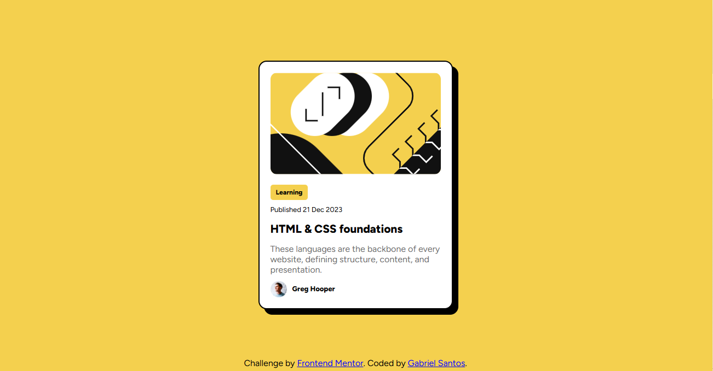

# 🚀 Blog Preview Card

[](https://gabriel7ven.github.io/blog_preview_card/)
[](https://reactjs.org/)
[](https://styled-components.com/)
[](https://vitejs.dev/)
[](https://www.frontendmentor.io)

> Card de visualização de blog criado como desafio no Frontend Mentor, utilizando React + Styled Components + Vite.



## 🛠️ Tecnologias Utilizadas

- ⚛️ **React** – Biblioteca para construção de interfaces
- 💅 **Styled Components** – Estilização com CSS-in-JS
- ⚡ **Vite** – Ferramenta de build moderna para desenvolvimento frontend

---

## 📦 Instalação e Uso

```bash
# Clone este repositório
git clone https://github.com/gabriel7ven/blog_preview_card.git

# Acesse a pasta do projeto
cd blog_preview_card

# Instale as dependências
npm install

# Inicie o servidor de desenvolvimento
npm run dev
